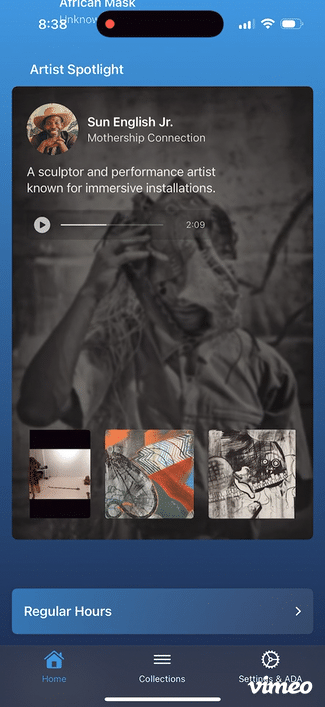
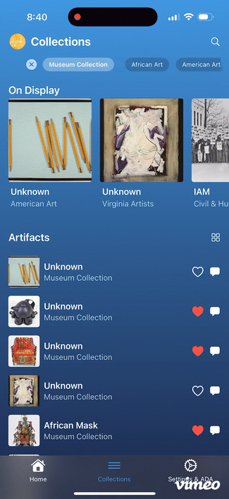
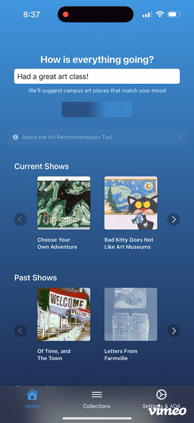

# LCVA Portal iOS Application

## Overview
The LCVA Portal is a native iOS application developed for the Longwood Center for Visual Arts (LCVA). This application serves as a digital gateway to LCVA's art collections, enabling users to explore, interact with, and learn about various artworks in the museum.

    


## Features

### Collections Management
- Browse the complete LCVA museum collection
- Filter artworks by various collections (African Art, American Art, etc.)
- Create personal collections of favorite artworks
- Add/remove artworks to personal collections
- Mark artworks as favorites within collections

### Artist Spotlight
- Featured artist showcase with media gallery
- Supports both images and videos
- Media ordered by curator preference
- Consistent media presentation across views
- Efficient media caching and preloading
- Full-screen media viewer with rotation support

### Art Piece Interaction
- View detailed information about each artwork
- High-quality artwork images
- Artwork metadata (title, artist, era, materials, etc.)
- Location information for displayed pieces
- Accessibility features (translations, audio tours, braille labels)

### Social Features
- Real-time chat discussions about specific artworks
- User authentication via Firebase
- Personal user profiles
- Share thoughts and insights about artworks

### Technical Implementation
- **Backend Services**:
  - Supabase for art collection data
  - Spotlight media management with ordered galleries
  - Custom RPC functions for optimized queries
  - Row Level Security (RLS) for data protection
  - Firebase for user authentication and real-time chat
  - Cloud storage for high-resolution images and videos (WebP, mp4)

- **Performance Optimizations**:

  - **Media Caching System**:
    - Custom FileManager-based caching
  - **Image Caching**:
    - First-load persistence to disk
    - Offline image availability
    - Memory-efficient loading
    - Specialized image views for different contexts:
      - Artist Spotlight galleries
      - On Display section images
      - Exhibition thumbnails
      - Collection grid views
      - List view thumbnails
  - **Video Caching**:
    - Concurrent download management
    - Memory and disk caching
    - Automatic player cleanup
    - Download state tracking
    - Error handling and recovery
    - Efficient player reuse

  - **Data Preloading**:
    - Unified PreloadManager
    - Concurrent artifact and exhibition loading
    - Background media prefetching
    - Progress tracking system
    - Efficient state management via managers
    - Reduced API calls through caching

- **Loading Architecture**:
  - Elegant splash screen with animations
  - Concurrent data loading behind splash
  - No visible loading indicators
  - Smooth transition to main content
  - Minimum display time for branding

- **Network Optimization**:
  - Single-fetch data persistence
  - Cached image responses
  - Bandwidth reduction through local storage
  - Smart reload policies

- **Data Models**:
  - UUID-based artifact identification
  - Structured art piece information
  - User collection management
  - Chat message system

- **UI/UX**:
  - SwiftUI-based interface
  - Responsive grid and list views
  - Custom navigation system
  - Dynamic filtering and search

## Architecture
- Modern Swift concurrency with async/await
- MVVM architecture
- Component-based UI design
- Real-time data synchronization
- Efficient data preloading and caching

### Loading Strategy
```swift
// Unified PreloadManager
class PreloadManager: ObservableObject {
    static let shared = PreloadManager()
    
    func preloadAllContent() async {
        // 1. Load artifacts
        // 2. Load exhibitions
        // 3. Preload images
    }
}

// Elegant Splash Screen
struct SplashView: View {
    @ObservedObject var preloadManager = PreloadManager.shared
    
    // Beautiful animations while loading
    // Waits for preloading completion
    // Smooth transition to main content
}
```

This architecture ensures:
- Professional first impression
- No visible loading screens
- Data ready when needed
- Efficient resource usage
- Polished user experience

## Dependencies
- Firebase
- FirebaseFirestore
- SwiftUI
- Custom Supabase Client with RPC support

## Features

- Firebase Authentication
- Firestore Database
- Supabase Integration
  - Artifact Storage
  - User Collections
  - User Profiles
    - Avatar URLs stored in Supabase users table
  - Reflections & Media Storage
- Real-time Chat
- Media Upload Support
  - Images
  - Videos
  - Text Reflections

## Database Structure

### Supabase Tables
- `users`
  - `id` (from Firebase Auth)
  - `email`
  - `name`
  - `created_at`
  - `avatar_url` - User's profile image URL
- `artifacts`
- `collections`
- `user_collections`
- `artifact_reflections`
- `chat_messages`

### Firebase Collections
- `users` (legacy, migrating to Supabase)
- `chats`

## Environment Setup

Required environment variables:
- `SUPABASE_URL`
- `SUPABASE_ANON_KEY`
- Firebase configuration

## Migration Notes

The app is gradually migrating user data from Firebase to Supabase:
- User profiles and avatars now stored in Supabase
- Chat messages remain in Firebase
- Media storage handled by Supabase Storage

## Database Functions

### Supabase RPC Functions
#### Implementation Strategy
The app uses a three-tier approach for efficient data management:

1. **ArtifactManager** - Singleton state container
```swift
@MainActor
class ArtifactManager: ObservableObject {
    static let shared = ArtifactManager()
    @Published var artifacts: [Artifact] = []
    
    func preloadArtifacts() async {
        // Preload artifacts at app launch
    }
}
```

2. **App-Level Preloading** - Data ready before user needs it
```swift
@main
struct LCVAPortalApp: App {
    @StateObject private var artifactManager = ArtifactManager.shared
    
    var body: some Scene {
        WindowGroup {
            ContentView()
                .task {
                    await artifactManager.preloadArtifacts()
                }
                .environmentObject(artifactManager)
        }
    }
}
```

3. **View-Level Consumption** - Clean, efficient data access
```swift
struct CollectionsView: View {
    @EnvironmentObject var artifactManager: ArtifactManager
    
    var displayedArtPieces: [ArtPiece] {
        artifactManager.artifacts
            .filter { $0.on_display }
            .map(convertToArtPiece)
    }
}
```

This architecture ensures:
- Data is loaded once at app launch
- No redundant network calls
- Consistent state across views
- Efficient memory usage

#### Available Functions
- `get_all_artifacts()`: Retrieves complete artifact collection
- `get_artifacts_by_collection(collection_name TEXT)`: Filters artifacts by collection
- `get_exhibition_data()`: Retrieves all exhibitions

Example usage in Swift:
```swift
// Fetch all artifacts
let artifacts = try await artifactService.fetchAllArtifacts()

// Fetch collection-specific artifacts
let collectionArtifacts = try await artifactService.fetchArtifactsByCollection(
    collectionName: "African Art"
)
```

## Caching Architecture

### Image Caching Implementation
```swift
class ImageCache {
    static let shared = ImageCache()
    private let cacheDirectory: URL
    
    func saveImageToDisk(image: UIImage, filename: String)
    func loadImageFromDisk(filename: String) -> UIImage?
    func imageExists(filename: String) -> Bool
}
```

### Video Caching Implementation
```swift
class VideoCache {
    static let shared = VideoCache()
    private let cacheDirectory: URL
    private var memoryCache: [String: AVPlayer] = [:]
    private var activeDownloads: [String: Task<Void, Error>] = [:]
    
    func cacheVideo(from url: URL, filename: String) async throws
    func getCachedVideo(urlString: String, filename: String) -> AVPlayer?
    func clearCache()
}
```

### Specialized Media Views
```swift
// Main collection grid images
struct CachedCollectionImageView: View {
    let urlString: String
    let filename: String
    // Optimized for grid display
}

// Thumbnail list images
struct CachedCollectionThumbView: View {
    let urlString: String
    let filename: String
    let size: CGFloat
    // Optimized for list views
}

// Video player with caching
struct CachedVideoPlayer: View {
    let urlString: String
    let filename: String
    // Handles loading, caching, and playback
}
```

### Benefits
- Instant loading of previously viewed media
- Reduced server load and bandwidth usage
- Offline functionality for cached content
- Optimized memory usage
- Context-specific media handling
- Concurrent download management
- Automatic resource cleanup

## Copyright
© 2024 Bobby "Sun" English and Longwood Center for Visual Arts. All rights reserved.
This application and its source code are the property of Sun English and LCVA.
Unauthorized copying, modification, or distribution is prohibited.